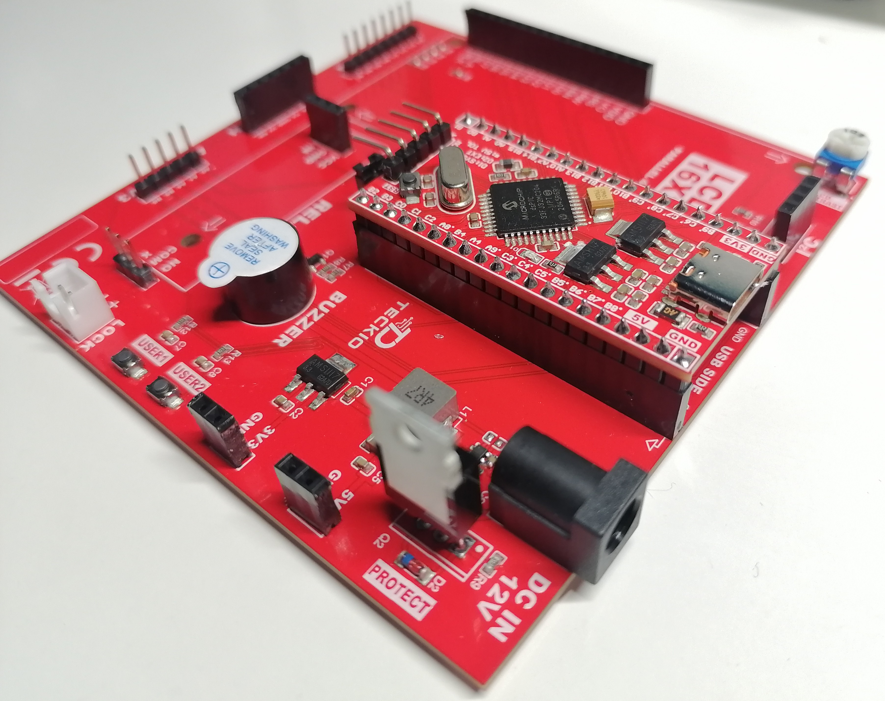
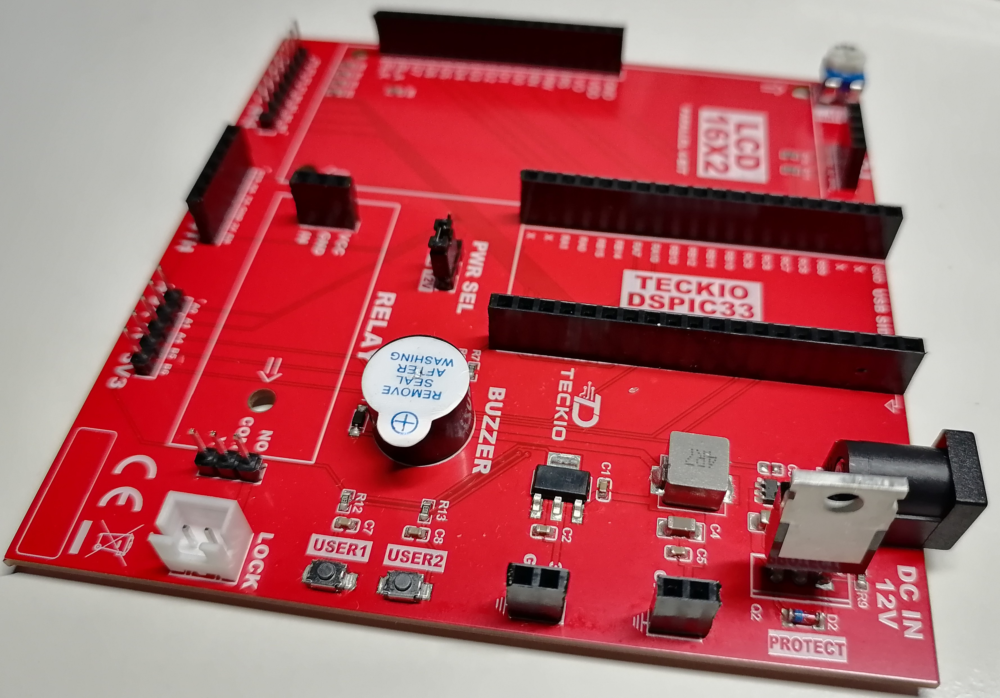

# TK LINK ACCESS-01

**Carrier de control de acceso · Rev A · TECKIO dsPIC33FJ Red Edition**

TK LINK ACCESS-01 integra una tarjeta TECKIO dsPIC33FJ con una base de periféricos para implementar acceso mediante PIN local o Bluetooth, apertura temporizada por relé e indicación mediante LCD y buzzer. El firmware también permite configurar cinco pines auxiliares y realizar transferencias I²C desde una interfaz compatible.

[Repositorio principal](../../README.md) · [Firmware HEX](Carrier_TKLINK_Acces.X.production.hex) · [Carrier Hub para Android](https://github.com/Dar-cpu/carriers/releases)



## Compatibilidad y alcance

| Elemento | Especificación |
| --- | --- |
| Carrier | TK LINK ACCESS-01, revisión A |
| Tarjeta de desarrollo | TECKIO dsPIC33FJ Red Edition |
| Microcontrolador compatible | **dsPIC33FJ32MC204** |
| Variante EP | **No compatible con esta carrier debido al módulo de relé** |
| Identificador del firmware | `TKLINK-ACCESS-01` |
| Versión declarada en los fuentes | `0.3.1` |
| Reloj configurado | Cristal de 8 MHz; FOSC = 80 MHz; FCY = 40 MHz |
| Enlace de comunicación | UART1, 9600 baudios, 8 bits, sin paridad, 1 bit de parada |
| Aplicación | Carrier Hub para Android, distribuida mediante Releases |

El archivo HEX publicado está destinado al **dsPIC33FJ32MC204**. Algunos archivos conservan condicionales de compilación para dsPIC33EP32MC204; su presencia no implica compatibilidad del EP con el hardware de esta revisión.

Esta carpeta comparte los **fuentes del firmware** y un **binario de producción HEX**. El código fuente de Carrier Hub no forma parte de este repositorio.

## Hardware de la carrier



En las fotografías se observan los conectores para la tarjeta TECKIO dsPIC33 y el LCD 16×2, las interfaces para módulos externos, el buzzer, los botones USER1/USER2, el selector de alimentación y la entrada marcada **DC IN 12V**. Los módulos de relé y Bluetooth, el teclado y el LCD no están instalados en las fotografías.

### Asignación de señales del firmware publicado

| Función | Pines | Uso |
| --- | --- | --- |
| LCD paralelo: RS y EN | RB10, RB11 | Selección de registro y habilitación. |
| LCD paralelo: D4–D7 | RB12–RB15 | Bus de datos de 4 bits. |
| Teclado 4×4: filas | RC0–RC3 | Barrido de filas. |
| Teclado 4×4: columnas | RC4–RC7 | Lectura de teclas. |
| UART1 TX / RX | RC8 / RC9 | Comunicación con el módulo Bluetooth; RP24 / RP25 en el FJ. |
| Bluetooth STATE / EN | RB3 / RB4 | Configurados como entradas; el firmware no fuerza el modo AT. |
| Relé | RB7 | Salida open-drain, activa en bajo. |
| Buzzer | RB2 | Señalización acústica. |
| USER1 / USER2 | RA7 / RA10 | Cancelar entrada / mostrar estado. |
| I²C1 SCL / SDA | RB8 / RB9 | Bus compartido por LCD I²C opcional y dispositivos externos. |
| Auxiliares analógicos/digitales | RA0, RA1 | GPIO o ADC. |
| Auxiliar de conteo | RA4 | GPIO, contador o frecuencia. |
| Auxiliares de PWM/captura | RB5, RB6 | GPIO, PWM, contador o frecuencia. |

**RB6 se utiliza como pin auxiliar configurable en esta versión.** No existe una función de sensor de puerta dedicada en el firmware publicado; el estado remoto de apertura describe el relé, no una medición física de la puerta.

## Funciones de control de acceso

- Validación de un PIN mediante teclado 4×4.
- Autenticación remota y apertura desde una interfaz compatible con el protocolo TK1.
- Apertura temporizada del relé y desactivación automática.
- Bloqueo temporal después de varios PIN incorrectos.
- Mensajes de estado en LCD 16×2 y avisos acústicos.
- Consulta de estado y selección remota de LCD paralelo o I²C.
- Configuración de GPIO, ADC, PWM, contador y frecuencia según el pin.
- Guardado explícito de la configuración auxiliar en memoria Flash.

### Valores predeterminados

Los siguientes valores se definen en [`access_config.h`](access_config.h):

| Parámetro | Valor |
| --- | --- |
| PIN de banco | `2580` |
| Tiempo de apertura | 5000 ms |
| Vigencia de la sesión remota | 30000 ms |
| Intentos fallidos antes del bloqueo | 3 |
| Duración del bloqueo | 30000 ms |
| Velocidad UART | 9600 baudios |
| LCD al arrancar | Paralelo |
| Dirección I²C inicial del LCD | `0x27`, dirección de 7 bits |

El PIN se establece al compilar; no hay un comando para cambiarlo ni una base de usuarios en esta versión. Para personalizarlo, modificar `ACCESS_PIN` y recompilar. El PIN de banco se publica expresamente para la puesta en marcha.

### Operación local

| Tecla o botón | Acción |
| --- | --- |
| `0`–`9` | Introducir el PIN; la pantalla muestra asteriscos. |
| `#` | Confirmar el PIN. |
| `*` | Borrar el último dígito. |
| `A` | Cancelar la entrada actual. |
| USER1 | Cancelar la entrada actual. |
| USER2 | Mostrar el estado actual en el LCD. |

El búfer admite hasta ocho dígitos; las entradas de menos de cuatro se descartan al confirmar. Un PIN válido activa el relé durante cinco segundos con la configuración predeterminada. Durante la apertura o el bloqueo, el teclado no acepta nuevas entradas de acceso.

La autenticación local abre el relé directamente y no deja una sesión remota disponible.

### Relé y temporización

RB7 se configura como salida **open-drain**: `LATB7 = 0` activa el relé y `LATB7 = 1` libera la línea. El arranque inicializa el relé apagado.

El firmware supervisa el vencimiento de la apertura tanto en la lógica de acceso como en la interrupción del temporizador. Una orden de apertura recibida cuando el relé ya está activo no prolonga el intervalo en curso.

## Puesta en marcha

### Programar el HEX publicado

1. Utilizar la carrier Rev A con la tarjeta **TECKIO dsPIC33FJ Red Edition**.
2. Descargar [`Carrier_TKLINK_Acces.X.production.hex`](Carrier_TKLINK_Acces.X.production.hex).
3. Conectar el programador por ICSP y seleccionar **dsPIC33FJ32MC204** en MPLAB IPE.
4. Importar el HEX, programar el dispositivo y verificar la operación.
5. Conectar los periféricos correspondientes y comprobar el acceso local con el PIN configurado.

La grabación del HEX se realiza por ICSP. El protocolo Bluetooth publicado no implementa actualización de firmware.

### Conectar Carrier Hub

1. Descargar e instalar la APK desde [Releases](https://github.com/Dar-cpu/carriers/releases).
2. Utilizar un módulo Bluetooth serie compatible, como HC-05/HC-06, con su enlace UART configurado a **9600 baudios, 8N1**.
3. Emparejar el módulo en Android y conectarlo desde Carrier Hub.
4. Consultar la identificación de la carrier y las funciones disponibles.
5. Autenticarse con el PIN para abrir el relé o modificar la configuración.

El firmware implementa el enlace UART y el protocolo de aplicación; no configura automáticamente el nombre, el PIN de emparejamiento ni la velocidad del módulo mediante comandos AT. El PIN de acceso del firmware es independiente del PIN de emparejamiento Bluetooth.

### Compilar los fuentes

La carpeta contiene los archivos C/H y el HEX; **no incluye el proyecto MPLAB X completo, `nbproject/` ni un Makefile de compilación**.

Para crear un proyecto:

1. Crear un proyecto independiente en MPLAB X para **dsPIC33FJ32MC204**, con el compilador **XC16**.
2. Añadir todos los archivos `.c` de esta carpeta y sus cabeceras.
3. Mantener `access_config.h` en la ruta de inclusión y ajustar los parámetros requeridos.
4. Compilar y revisar el mapa de memoria, incluidas las secciones `.aux_store_a` y `.aux_store_b` que utiliza el guardado auxiliar.
5. Programar el HEX generado y verificar el comportamiento en la carrier.

No se especifica una versión exacta de XC16 ni del paquete de dispositivo en los archivos publicados. El HEX incluido permite utilizar la entrega sin reconstruir el proyecto.

## Organización del firmware

| Archivo | Responsabilidad |
| --- | --- |
| [`main.c`](main.c) | Bits de configuración, PLL, inicialización y bucle principal. |
| [`access_config.h`](access_config.h) | Modelo, versión, PIN, tiempos, UART y LCD predeterminado. |
| [`board.c`](board.c), [`board.h`](board.h) | GPIO, PPS, UART, base de tiempo, relé, buzzer, teclado y botones. |
| [`access.c`](access.c), [`access.h`](access.h) | Validación de PIN, sesiones, bloqueo y apertura temporizada. |
| [`protocol.c`](protocol.c), [`protocol.h`](protocol.h) | Recepción de tramas TK1, CRC, comandos y respuestas. |
| [`lcd.c`](lcd.c) | LCD 16×2 por interfaz paralela o expansor PCF8574. |
| [`i2c_bus.c`](i2c_bus.c), [`i2c_bus.h`](i2c_bus.h) | Control I²C1, transferencias, tiempos de espera y recuperación del bus. |
| [`aux.c`](aux.c), [`aux.h`](aux.h) | Configuración auxiliar, filtrado ADC, consultas y comandos AUX/I²C. |
| [`aux_plan.c`](aux_plan.c) | Validación de parámetros y cálculo de prescaler/período PWM. |
| [`aux_hal.c`](aux_hal.c), [`aux_hal.h`](aux_hal.h) | Configuración de periféricos, PPS e interrupciones de ADC, captura y conteo. |
| [`aux_nvm.c`](aux_nvm.c), [`aux_nvm.h`](aux_nvm.h) | Persistencia de configuración auxiliar en dos páginas Flash con generación y CRC. |
| [`Carrier_TKLINK_Acces.X.production.hex`](Carrier_TKLINK_Acces.X.production.hex) | Binario publicado para programar el dsPIC33FJ32MC204. |

### Recursos utilizados en esta versión

| Recurso | Uso |
| --- | --- |
| Timer1 | Contador externo de RA4, con extensión por software a 32 bits. |
| Timer2 | Scheduler de 500 µs; base de milisegundos, vigilancia del relé y planificación ADC. También se selecciona como base de captura para IC1/IC2. |
| Timer3 | Base compartida de PWM para OC1 y OC2. |
| Timer4 / Timer5 | Sin uso en el código publicado. |
| OC1 / OC2 | PWM de RB5 / RB6. |
| IC1 / IC2 | Captura de flancos ascendentes para contar pulsos en RB5 / RB6. |
| ADC1 | Conversión de RA0/AN0 y RA1/AN1. |
| UART1 | Comunicación serie con Bluetooth. |
| I²C1 | LCD I²C opcional y transferencias a dispositivos externos. |

**Los dos canales PWM comparten frecuencia en esta versión.** Sus ciclos de trabajo se configuran por separado. El firmware rechaza frecuencias diferentes con `PWM_SHARED_FREQ`. Esta documentación describe el código publicado, que mantiene el scheduler en Timer2.

## Pines auxiliares

La aplicación envía modos y parámetros físicos. El firmware valida la combinación, calcula los registros y habilita los periféricos correspondientes.

| Pin | Modos disponibles |
| --- | --- |
| RA0, RA1 | `OFF`, `DI`, `DO`, `ADC` |
| RA4 | `OFF`, `DI`, `DO`, `COUNT`, `FREQ` |
| RB5, RB6 | `OFF`, `DI`, `DO`, `PWM`, `COUNT`, `FREQ` |

### Parámetros de AUXSET

La carga útil sigue el formato `PIN,MODO,parametros`. Los parámetros numéricos son enteros decimales sin signo.

| Modo | Parámetros, en orden | Valores admitidos |
| --- | --- | --- |
| `OFF` | Ninguno | Pin en entrada, sin pull-up interno habilitado. |
| `DI` | Pull-up, flanco, antirrebote | Pull-up: 0/1; flanco: 0=sin conteo, 1=subida, 2=bajada, 3=ambos; antirrebote: 0–1000 ms. |
| `DO` | Nivel | 0 o 1. |
| `ADC` | Bits, muestras/s, adquisición, promedio, filtro, publicación | Bits: 10/12; tasa: 1–1000 por canal; adquisición: 0–100 µs, con 0=2 µs; promedio: 1/4/8/16 muestras; filtro: 0=ninguno, 1=media móvil de 8, 2=IIR con factor 1/8; publicación: 10–10000 ms. |
| `PWM` | Frecuencia, duty, polaridad, nivel inicial | Frecuencia: 10–100000 Hz; duty: 0–1000, donde 1000=100%; polaridad: 0=activo alto, 1=activo bajo; nivel inicial: 0/1 durante la configuración. |
| `COUNT`, `FREQ` | Ventana de actualización | 100–10000 ms. |

Si RA0 y RA1 trabajan como ADC, ambos deben usar la misma resolución; de lo contrario se devuelve `ADC_SHARED_BITS`. Las lecturas ADC son cuentas digitales, no voltios calibrados.

En `COUNT` y `FREQ`, la consulta devuelve el total de pulsos y la frecuencia calculada como incremento de conteo dividido entre el tiempo transcurrido. En RB5/RB6, el firmware detiene la captura y marca `FAULT=1` si detecta desbordamiento o supera su presupuesto de servicio; el rango de PWM no representa un rango garantizado de medición de frecuencia.

Ejemplos de cargas útiles:

| Objetivo | Carga útil de AUXSET |
| --- | --- |
| RA0 como ADC de 12 bits, 100 muestras/s y promedio de 8 | `RA0,ADC,12,100,2,8,0,500` |
| RA4 como contador, con actualización cada segundo | `RA4,COUNT,1000` |
| RB5 como PWM de 1 kHz al 50%, activo alto | `RB5,PWM,1000,500,0,0` |
| RB6 como entrada con pull-up y antirrebote de 20 ms | `RB6,DI,1,3,20` |
| Desactivar RB5 | `RB5,OFF` |

### Persistencia

`AUXSET` aplica la configuración en RAM. `AUXSAVE` guarda los modos y parámetros de los cinco pines y la velocidad I²C en Flash; `AUXNVM` informa si se cargó una configuración válida y si existen cambios pendientes.

El guardado con cambios pausa los periféricos auxiliares y reinicia contadores y filtros al reanudarlos. Sin cambios pendientes, `AUXSAVE` responde `CHANGED=0` y no vuelve a escribir.

El PIN, los contadores y la selección de transporte/dirección del LCD no forman parte de este guardado. Al reiniciar, el LCD toma los valores de `access_config.h`. Sin una configuración auxiliar válida, los pines auxiliares arrancan en `OFF` y el bus I²C a 100 kHz.

## LCD e I²C

El LCD paralelo utiliza RB10–RB15. Como alternativa, el firmware admite un LCD con adaptador **PCF8574/PCF8574A** en RB8/SCL y RB9/SDA, con el siguiente mapeo del expansor:

| Señal del expansor | Función LCD |
| --- | --- |
| P0 / P1 / P2 / P3 | RS / RW / EN / retroiluminación |
| P4–P7 | D4–D7 |

`LCDSET` acepta `PARALLEL` o `I2C,27`, por ejemplo. Las direcciones admitidas para el LCD son `0x20–0x27` y `0x38–0x3F`. Una selección I²C fallida intenta restaurar el transporte anterior.

El bus externo admite solicitudes de 100, 400 o 1000 kHz. Con LCD I²C activo, queda limitado a **100 kHz** y su dirección se reserva frente a transferencias genéricas. La velocidad seleccionada debe ser compatible con los dispositivos conectados.

`I2CXFER` utiliza `AA,TXHEX,N`: dirección de 7 bits en dos dígitos hexadecimales mayúsculos, bytes a escribir en hexadecimal y cantidad decimal de bytes a leer. Admite direcciones `08–77` y hasta 16 bytes por sentido. Si hay escritura y lectura, realiza un START repetido entre ambas.

## Protocolo serie TK1

Las tramas son ASCII, terminadas en salto de línea:

```text
@TK1|SEQ|COMANDO|PAYLOAD|CRC\n
```

- `SEQ`: secuencia decimal de uno a tres dígitos, reproducida en la respuesta.
- `PAYLOAD`: argumentos del comando; el campo permanece vacío cuando no se requieren.
- `CRC`: cuatro dígitos hexadecimales mayúsculos, CRC-16/CCITT-FALSE, polinomio `0x1021`, inicial `0xFFFF`, sin reflexión ni XOR final.
- El CRC cubre desde `TK1` hasta el final de `PAYLOAD`, incluidos los separadores intermedios. Excluye `@` y el separador anterior al CRC.
- La respuesta conserva el formato y utiliza `OK` o `ERR` en el campo de comando.
- Las tramas recibidas admiten hasta 95 caracteres antes del salto de línea; las tramas malformadas o con CRC incorrecto se descartan sin respuesta.

### Comandos

| Comando | Payload | Función | Requiere AUTH |
| --- | --- | --- | --- |
| `HELLO` | Vacío | Modelo, hardware, firmware y capacidades. | No |
| `STATUS` | Vacío | Estado lógico: `CLOSED`, `OPEN` o `LOCKOUT`. | No |
| `AUTH` | PIN de 4–8 dígitos | Crear una sesión temporal. | No |
| `OPEN` | Vacío | Solicitar apertura temporizada. | Sí |
| `BYE` | Vacío | Cerrar la sesión. | No |
| `LCDGET` | Vacío | Consultar transporte, dirección y estado LCD. | No |
| `LCDSET` | `PARALLEL` o `I2C,AA` | Cambiar el transporte LCD. | Sí |
| `AUXCAP` | Vacío o nombre de pin | Consultar capacidades generales o por pin. | No |
| `AUXGET` | Nombre de pin | Consultar modo y parámetros A–F. | No |
| `AUXSET` | `PIN,MODO,...` | Aplicar una configuración auxiliar. | Sí |
| `AUXREAD` | Nombre de pin | Leer valor, conteo, frecuencia y banderas. | No |
| `AUXSAVE` | Vacío | Guardar la configuración auxiliar y velocidad I²C. | Sí |
| `AUXNVM` | Vacío | Consultar `LOADED`, `DIRTY` y esquema. | No |
| `I2CGET` | Vacío | Consultar velocidad y reserva del LCD. | No |
| `I2CSET` | `100`, `400` o `1000` | Cambiar velocidad del bus. | Sí |
| `I2CXFER` | `AA,TXHEX,N` | Realizar una transferencia I²C. | Sí |

La sesión es de **un solo uso** para apertura o configuración: cada operación protegida consume la autenticación. Se debe enviar un nuevo `AUTH` antes de la siguiente operación protegida. Los cambios de configuración y las transferencias I²C se rechazan con `BUSY` mientras el relé está activo.

`AUXREAD` devuelve `PIN`, `MODE`, `VALUE`, `COUNT`, `HZ`, `FAULT` y `VALID`. En PWM, `VALUE` es el duty en milésimas y `HZ` la frecuencia calculada por el firmware. `AUXCAP` anuncia `POLL_MIN=500`: las consultas auxiliares deben respetar ese intervalo mínimo recomendado de 500 ms.

El CRC detecta errores de transmisión; no cifra el PIN ni el contenido de las tramas.

## Aplicación y soporte

La APK de **Carrier Hub** se descarga desde [Releases](https://github.com/Dar-cpu/carriers/releases). Sus notas indican las funciones de cada versión; la disponibilidad de AUX depende de que el firmware anuncie la capacidad `AUX1`. Los fuentes Android no se distribuyen en esta carpeta ni en el repositorio público.

Para reportar un problema, abrir un [Issue](https://github.com/Dar-cpu/carriers/issues) e incluir la revisión de la carrier, versiones de firmware y app, periféricos conectados y pasos para reproducirlo.

[Volver a TECKIO Carriers](../../README.md) · [teckio.pe](https://teckio.pe)
